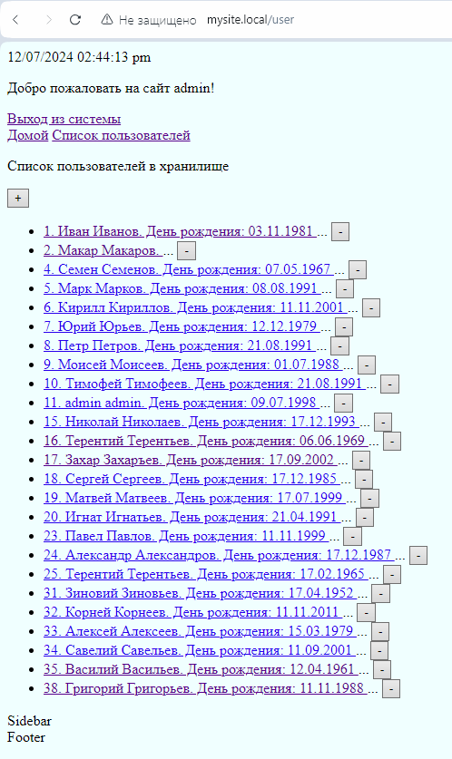

# Урок 7. Формы, Авторизация и аутентификация

 
## 1. При помощи регулярных выражений усильте проверку данных в validateRequestData так, чтобы пользователь не смог передать на обработку любую строку, содержащую HTML-теги (например, ```<script>```)

### В модель User метод validateRequestData() добавлено условие:

```
    if (preg_match('/<([^>]*)>/', $_POST['name']) ||
        preg_match('/<([^>]*)>/', $_POST['lastname']) ||
        preg_match('/<([^>]*)>/', $_POST['lastname']))
    {
        $result = false;
    }
```

```
public static function validateRequestData(): bool{

    $result = true;

    if(
        !(isset($_POST['name']) && !empty($_POST['name']) &&
        isset($_POST['lastname']) && !empty($_POST['lastname']) &&
        isset($_POST['birthday']) && !empty($_POST['birthday']))
    ){
        $result = false;
    }
    if (!preg_match('/^(\d{2}-\d{2}-\d{4})$/', $_POST['birthday'])) {
        $result = false;
    }
    if (preg_match('/<([^>]*)>/', $_POST['name']) ||
        preg_match('/<([^>]*)>/', $_POST['lastname']) ||
        preg_match('/<([^>]*)>/', $_POST['lastname']))
    {
        $result = false;
    }
    if (!isset($_SESSION['csrf_token']) || $_SESSION['csrf_token'] != $_POST['csrf_token']) {
        $result = false;
    }

    return $result;
}
```

## 2. Доработайте шаблон аутентификации. В нем нужно добавить две вещи:

В приветствии нужно выводить имя залогинившегося пользователя.

### Модифицировал auth.tpl

```

    <p><a href="/user/auth/">Вход в систему</a></p>

    <p>Добро пожаловать на сайт {{ user_name }}!</p>

```

### Добавлена строка в функцию renderPage класса Render  

```
    if(isset($_SESSION['user_name'])) {
        $templateVariables['user_authorised'] = true;
        $templateVariables['user_name'] = $_SESSION['user_name'];
    }
```

```
public function renderPage(string $contentTemplateName = 'page-index.tpl', array $templateVariables = []) {

    $template = Render::$environment->load('main.tpl');

    $templateVariables['content_template_name'] = $contentTemplateName;

    $templateVariables['content_template_cur_time'] = Time::getCurrentTime(); // Текущее время
    $templateVariables['content_template_header'] = 'site-header.tpl'; // Шапка
    $templateVariables['content_template_footer'] = 'site-footer.tpl'; // Подвал
    $templateVariables['content_template_sidebar'] = 'site-sidebar.tpl'; // Sidebar

    if(isset($_SESSION['user_name'])) {
        $templateVariables['user_authorised'] = true;
        $templateVariables['user_name'] = $_SESSION['user_name'];
    }

    return $template->render($templateVariables);
}
```

Также надо выводить ссылку «Выйти из системы», которая будет уничтожать сессию пользователя.

### Модифицировал auth.tpl

```

    <p><a href="/user/auth/">Вход в систему</a></p>

    <p>Добро пожаловать на сайт {{ user_name }}!</p>
    <a href="/user/logout">Выход из системы</a>

```

### В UserController добавил

```
public function actionLogout(): void {
    session_destroy();
    unset($_SESSION['user_name']);
    unset($_SESSION['user_lastname']);
    unset($_SESSION['id_user']);
    unset($_SESSION['csrf_token']);
    header('Location: /');
    die();
}
```

## 3. Переработайте имеющийся функционал приложения на формы.

Создание, обновление и удаление пользователя теперь должно производиться через формы.

Если пользователь обновляется, в форму должны быть выведены текущие значения. Это может быть сделано ссылкой из списка пользователей (рядом с каждым из них будет своя ссылка “Обновить данные”).

### Изменил шаблон user-index.tpl для вывода списка пользователей и элементов управления списком (кнопки добавить, удалить), также каждая строка списка является ссылкой для редактирования объекта:

```
<p>Список пользователей в хранилище</p>
<form action="/user/edit" method="post">

<button name="action" value="+">+</button>

<ul id="navigation">
    
       <li>
          <a href="/user/edit/?id={{user.getUserId()}}">
             {{user.getUserId()}}.
             {{user.getUserName()}} {{user.getUserLastName()}}.
             
                День рождения: {{user.getUserBirthday() | date('d.m.Y')}}
             
          </a>
          <span>...</span>
          <button name="action" value="{{user.getUserId()}}">-</button>
       </li>
    
</ul>
</form>
```

### Добавил метод actionEdit в контроллер UserController:

```
public function actionEdit() {

    $id = $this->getCorrectedId();

    // Удаление пользователя
    If (isset($_POST['action']) && $_POST['action'] != '+') {

        $id = $_POST['action'];

        if(User::exists($id)) {
            User::deleteFromStorage($id);
            header('Location: ' . '/user');
            die();
        }
        else {
            throw new \Exception("Пользователь не существует");
        }
    }

    // Редактирование пользователя
    if(User::exists($id)) {

        $user = User::getUserFromStorageById($id);

        $render = new Render();
        return $render->renderPageWithForm("user-form.tpl",
            [
                'title' => 'Изменение пользователя',
                'message' => 'Изменение пользователя',
                'user' => $user,
                'action' => 'update'
            ]);
    }
    // Создание пользователя
    else {

        $render = new Render();
        return $render->renderPageWithForm("user-form.tpl",
            [
                'title' => 'Новый пользователь',
                'message' => "Новый пользователь",
                'action' => 'save'
            ]);
    }
}
```
```
private function getCorrectedId(): int
{
    return (isset($_GET['id'])) ? (int)$_GET['id'] : 0;
}
```

### Переделал user-form.tpl:

### В строке 
```
<form action="/user/{{action}}" method="post">
```
### переходим на нужный метод контроллера UserController,
### также передаю в строке
```
<input id="id-user" type="hidden" name="id_user" value="{{user.getUserId()}}">
```
### id пользователя с которым необходимо провести манипуляции
### в строках
```
<input id="user-name" type="text" name="name" value="{{user.getUserName()}}">
<input id="user-lastname" type="text" name="lastname" value="{{user.getUserLastName()}}">
<input id="user-birthday" type="text" name="birthday" placeholder="ДД-ММ-ГГГГ" value="{{user.getUserBirthday() | date('d-m-Y')}}">
```
### заполняю соответственно поля name, lastname, birthday редактируемого объекта
```
<h2>{{message}}</h2>

<form action="/user/{{action}}" method="post">
    <input id="csrf_token" type="hidden" name="csrf_token" value="{{csrf_token}}">
    <input id="id-user" type="hidden" name="id_user" value="{{user.getUserId()}}">
    <p>
        <label for="user-name">Имя:</label>
        <input id="user-name" type="text" name="name" value="{{user.getUserName()}}">
    </p>
    <p>
        <label for="user-lastname">Фамилия:</label>
        <input id="user-lastname" type="text" name="lastname" value="{{user.getUserLastName()}}">
    </p>
    <p>
        <label for="user-birthday">День рождения:</label>
        <input id="user-birthday" type="text" name="birthday" placeholder="ДД-ММ-ГГГГ" value="{{user.getUserBirthday() | date('d-m-Y')}}">
    </p>
    <p>
        <input type="submit" value="Сохранить"
    </p>
</form>
```

## 4. *Создайте функцию “Запомнить меня” в форме логина.

В форме должен появиться checkbox “Запомнить меня”.

### В user-auth.tpl добавил
```
    <p>
        <label for="user-remember">Запомнить:</label>
        <input  id=”user-remember” type="checkbox" name='user-remember' value='remember'>
    </p>
```

```

    {{auth-error}}


<form action="/user/login/" method="post">
    <input id="csrf_token" type="hidden" name="csrf_token" value="{{csrf_token}}">
    <p>
        <label for="user-login">Логин:</label>
        <input id="user-login" type="text" name="login">
    </p>
    <p>
        <label for="user-login">Пароль:</label>
        <input id="user-password" type="password" name="password">
    </p>
    <p>
        <label for="user-remember">Запомнить:</label>
        <input  id=”user-remember” type="checkbox" name='user-remember' value='remember'>
    </p>
    <p>
        <input type="submit" value="Войти">
    </p>
</form>
```

При нажатии на него в процессе логина пользователю выдаётся cookie, по которому происходит автоматическая авторизация, даже если сессия закончилась. \
При логине нужно будет генерировать токен из random_bytes(), размещая его в cookies и БД, чтобы сравнивать их

### В метод actionLogin контроллера UserController изменил строку

```
$result = Application::$auth->proceedAuth($_POST['login'], $_POST['password'], isset($_POST['user-remember']));
```

```
public function actionLogin(): string {

    $result =false;

    if (isset($_POST['login']) && isset($_POST['password'])) {
        // Если checkbox "сохранить" установлен передаем параметром в процедуру аутентификации
        $result = Application::$auth->proceedAuth($_POST['login'], $_POST['password'], isset($_POST['user-remember']));
    }

    if (!$result) {
        $render = new Render();
        return $render->renderPageWithForm('user-auth.tpl',
            [
                'title' => 'Форма логина',
                'auth-success' => false,
                'auth-error' => 'Неверные логин и (или) пароль'
            ]);
    } else {
        header('Location: /');
        return "";
    }
}
```

### изменил метод proceedAuth в классе Auth

```
public function proceedAuth(string $login, string $password, bool $saveMe=false): bool {
    $sql = "SELECT id_user, user_name, user_lastname, password_hash, hash FROM users WHERE login = :login";

    $handler = Application::$storage->get()->prepare($sql);
    $handler->execute(['login' => $login]);
    $result = $handler->fetchAll();

    if (!empty($result) && password_verify($password, $result[0]['password_hash'])) {

        $this->fillSessionDataByUserData($result[0]['user_name'],
                                         $result[0]['user_lastname'],
                                         $result[0]['id_user']
        );

        // Здесь устанавливаем куку токен пользователя user-token, а также записать в базу в таблицу users поле hash
        if ($saveMe){
            // Создаем токен
            $userToken = $this->generateToken();
            // Пишем созданный токен в куки user-token
            setcookie("user-token", $userToken, time() + 60 * 60 * 12 * 1, '/');
            // Пишем токен в таблицу users в поле hash
            User::setToken($result[0]['id_user'], $userToken);
        }

        return true;
    }
    return false;
}
```
### для чего создал два дополнительных метода в классе Auth
```
public function fillSessionDataByUserData($userName, $userLastName, $userId) {
    $_SESSION['user_name'] = $userName;
    $_SESSION['user_lastname'] = $userLastName;
    $_SESSION['id_user'] = $userId;
}
```
### и
```
public function generateToken() {
    return bin2hex(random_bytes(32));
}
```
### а в модели User метод
```
public static function setToken($id_user ,$token) {
    $sql = "UPDATE users SET hash = :token WHERE id_user = :id_user";

    $handler = Application::$storage->get()->prepare($sql);
    $handler->execute(['id_user' => $id_user, 'token' => $token]);
}
```
### добавил в метод run класса Application строку
```
    // Восстанавливаем сессию, если есть cookie user-token и нет сессии
    $this::$auth->restoreSession();

```
### перед строкой
```
    session_start();
```
### метод restoreSession определяю в классе Auth
```
public function restoreSession() {

    // Если кука с user-token существует и сессия не существует
    if (isset($_COOKIE['user-token']) && !isset($_SESSION['id_user'])) {

        // Если пользователь с таким user-token существует
        if (User::tokenExist($_COOKIE['user-token'])) {
            // Получаем пользователя с таким user-token
            $user = User::getUserFromStorageByToken($_COOKIE['user-token']);
            // Наполняем сессию данными
            $this->fillSessionDataByUserData($user->getUserName(),
                                             $user->getUserLastName(),
                                             $user->getUserId()
            );
        }
    }
}
```

При выходе из системы токен надо деактивировать.

### меняю метод actionLogout контроллера UserController
```
public function actionLogout(): void {
    session_destroy();
    unset($_SESSION['user_name']);
    unset($_SESSION['user_lastname']);
    unset($_SESSION['id_user']);
    unset($_SESSION['csrf_token']);

    if (isset($_COOKIE['user-token'])) {
        unset($_COOKIE['user-token']);
        setcookie('user-token', '', -1, '/');
    }

    header('Location: /');
    die();
}
```

## 5. Исправьте потолстевший Абстрактный контроллер.

### В AbstractController изменил:

```
public function getUserRoles(): array {
    $roles = [];

    if (isset($_SESSION['id_user'])) {

        $result = User::getUserRoleById();
        if (!empty($result)) {
            foreach ($result as $role) {
                $roles[] = $role;
            }
        }
    }
    return $roles;
}
```

### В User добавил:

```
    public static function getUserRoleById() {

        $sql = "SELECT * FROM user_roles WHERE id_user = :id_user";
        $handler = Application::$storage->get()->prepare($sql);
        $handler->execute(['id_user' => $_SESSION['id_user']]);

        $queryResult = $handler->fetchAll();

        $roles =[];

        foreach ($queryResult as $item) {
            $roles[] = $item['role'];
        }

        return $roles;
    }
    
```


---





---

